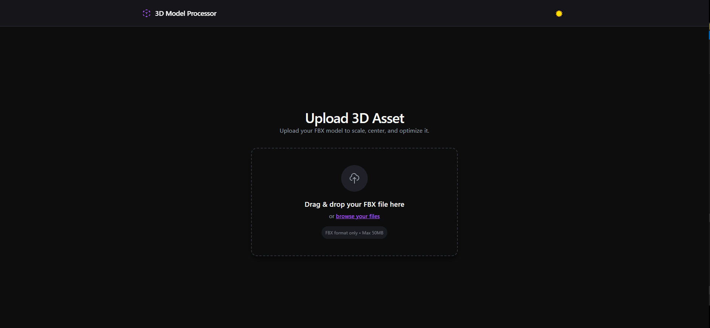
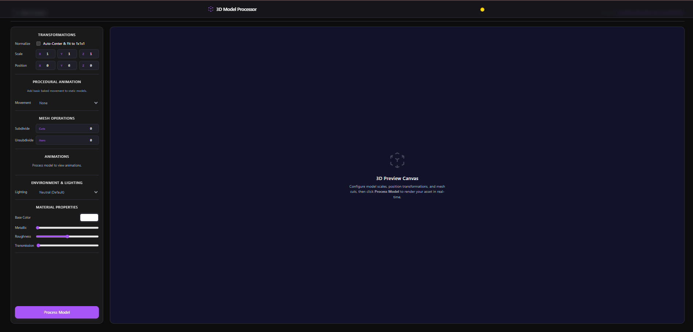
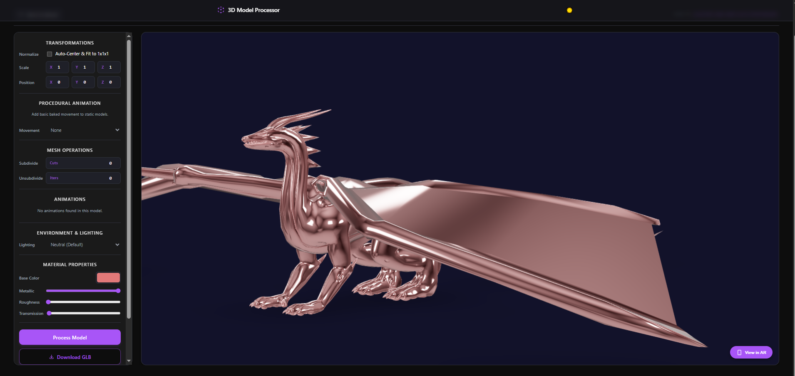
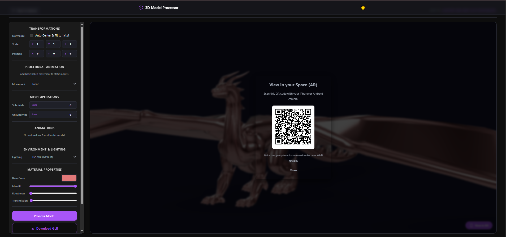

# Web-Based 3D FBX to GLB Processing App

This application is a powerful, web-based 3D asset processing pipeline. It allows users to upload 3D models (like FBX files), perform real-time mesh operations (subdivision, scale normalization), apply custom material properties (metallic, roughness, colors), and procedurally bake animations directly from their browser. The backend leverages Blender's Python API (`bpy`) to process these transformations headless-ly, while the frontend provides an interactive, AR-ready 3D preview using `<model-viewer>`.

## Features
- **FBX to GLB Conversion:** Instantly convert heavy `.fbx` assets into lightweight, web-ready `.glb` files via headless Blender processing.
- **Mesh Operations:** Perform non-destructive geometric edits, including Subdivision and Unsubdivision directly from the UI.
- **Auto-Normalization:** A one-click fix to automatically calculate the model's bounding box, center it to the origin `[0,0,0]`, and scale it perfectly into a 1x1x1 unit cube.
- **Advanced Material Studio:** Override default textures with customized PBR materials (Base Color, Metallic, Roughness, and Transmission/Glass) on the fly.
- **Environment Lighting:** Real-time HDR environment swapper (Studio, Sunset, Forest, etc.) to preview how your model reacts to different lighting conditions.
- **Procedural Animations:** Breathe life into completely static models by injecting baked procedural animations (Spin, Float, Bounce).
- **Animation Playback:** Native detection and smooth playback of existing animation tracks baked into the uploaded FBX files.
- **Instant AR (Augmented Reality):** Dynamic QR code generation allowing users to view processed `.glb` models instantly in their physical space via their mobile device (WebXR/AR Quick Look/Scene Viewer).
- **Multi-Format Export:** Download processed models not just as `.glb`, but also as cleanly reformatted `.obj` and `.fbx` files.

## Tech Stack
- **Frontend:** React 19, Vite, React Router, and standard CSS3 (custom glassmorphism UI)
- **3D Preview:** Google's `<model-viewer>` Web Component
- **Backend:** Node.js, Express.js, Multer (for robust local file uploads)
- **3D Processing Engine:** Python 3, Blender Python API (`bpy`) running in headless mode

## Prerequisites

To run this application locally, you will need:
- **Node.js** (v18 or higher recommended)
- **Python 3.x**
- **bpy (Blender Python API)**: `pip install bpy`

## How to Run

1. Clone this repository.
2. Install all dependencies for both the frontend and backend:
   ```bash
   npm run install:all
   ```
3. Start the development server (runs both the React frontend and Express backend concurrently):
   ```bash
   npm run dev
   ```
4. Open your browser to the URL provided in the terminal (e.g., `http://localhost:5173`).

## Sample Files
A sample `.fbx` file is provided in the `sample/` directory. You can use this file to quickly test out the application's mesh operations, material adjustments, procedural animations, and AR capabilities.

## Screenshots

<table>
  <tr>
    <td></td>
    <td></td>
  </tr>
  <tr>
    <td></td>
    <td></td>
  </tr>
</table>
